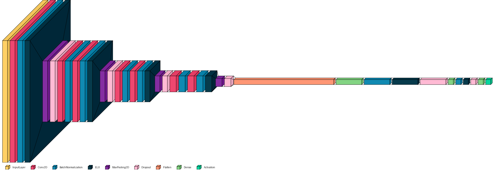
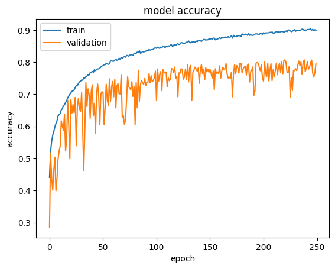
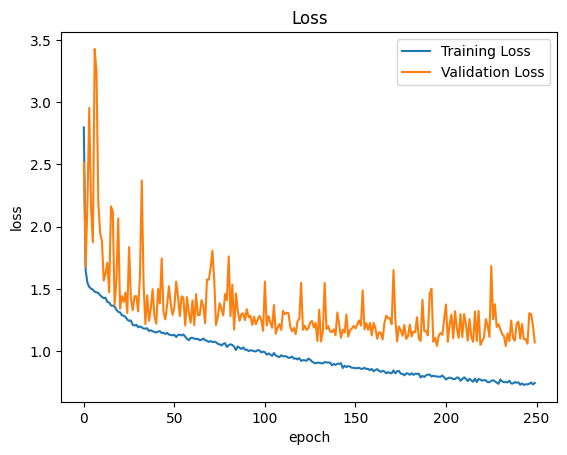
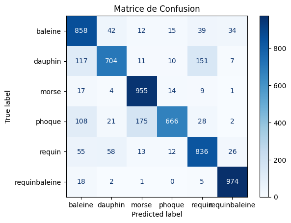
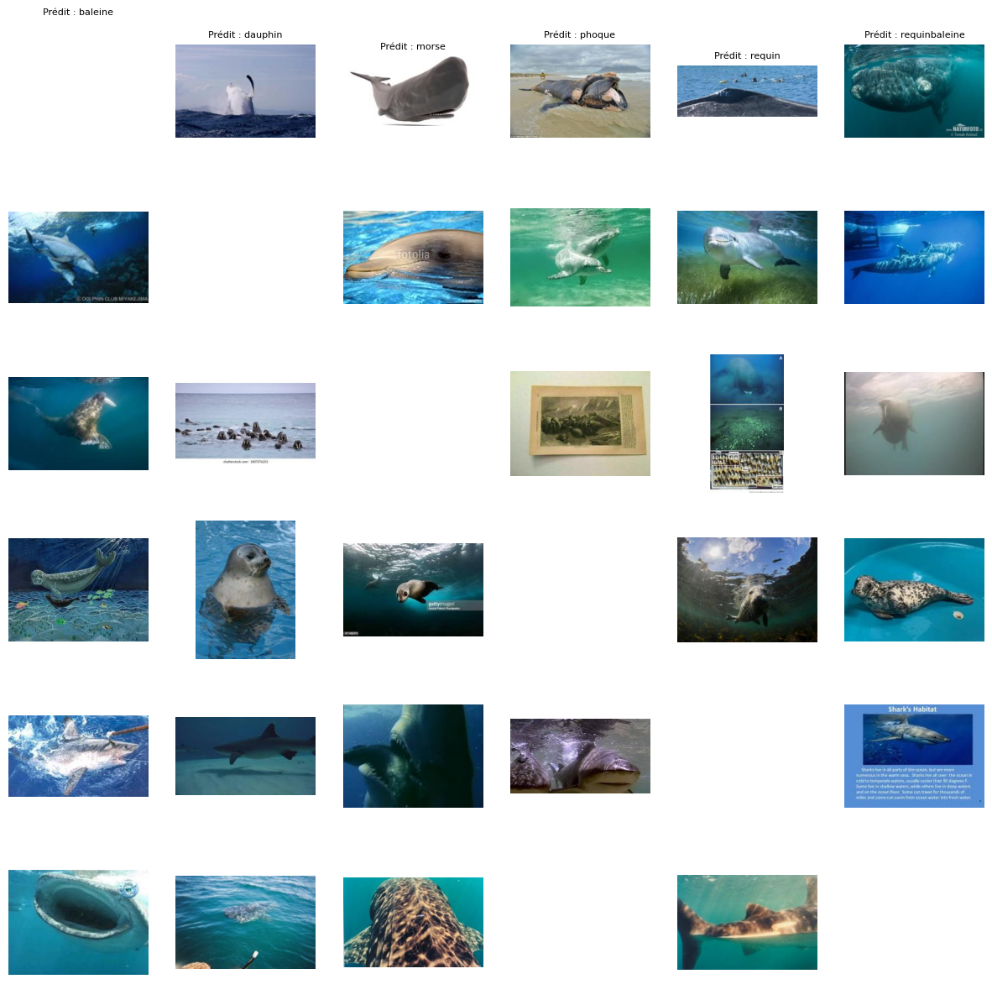

# marine-species-image-classification

## Description

Ce projet a été réalisé dans le cadre du Travail Pratique 2 du cours `Apprentissage Automatique (INF7370)`, offert durant la session d’hiver 2025 par M. Mouhamed Bouguessa à l’Université du Québec à Montréal (UQAM).

Il vise à développer un modèle de deep learning basé sur un réseau de neurones à convolution (CNN) capable de classifier à partir d’images six espèces aquatiques :
* Baleine
* Dauphin
* Morse
* Phoque
* Requin
* Requin-Baleine

L’objectif principal est de définir une architecture du modèle qui nous permettra d’obtenir une exactitude minimale de 82 % sur les données de test.

## Structure du projet

| Dossier/Fichier    | Description                                                             |
| ------------------ | ----------------------------------------------------------------------- |
| `modele.ipynb`      | Création de l'architecture et entraînement du modèle            |
| `evaluation.ipynb`  | Application du modèle entrainé sur les données de test et évaluation des performances |
| `images/`           | Visualisations et graphiques      |
| `README.md`         | Ce fichier de présentation                                              |
| `requirements.txt`  | Dépendances Python nécessaires                                          |

## Modèle

Le modèle est un CNN personnalisé composé de plusieurs blocs convolutifs suivis de couches denses :

* 4 blocs convolutifs :

    * couches Conv2D (filtres 32 → 64 → 128 → 256)

    * BatchNormalization, ELU, MaxPooling2D, Dropout

* Partie dense :

    * Flatten

    * Couche dense de 1024 neurones + ELU, BatchNormalization, Dropout

    * Couche dense de 32 neurones + ELU, BatchNormalization, Dropout

    * Sortie : 6 neurones avec activation Softmax

Il est donné par l'architecture suivante :

> **Accuracy entraînement**: `90%`  
> **Accuracy validation**: `81%` 

### Visualisation de la courbe d'exactitude entraînement/validation

### Visualisation de la courbe de perte entraînement/validation

## Données

| Espèces         | Images entraînement | Images test |
|----------------|------------------|--------------|
| Baleine          | 4,000            | 1,000        |
| Dauphin        | 4,000            | 1,000        |
| Morse         | 4,000            | 1,000        |
| Phoque           | 4,000            | 1,000        |
| Requin          | 4,000            | 1,000        |
| Requin Baleine    | 4,000            | 1,000        |

**Total images**: 30,000  
**Training/Validation split**: 80% / 20%

## Détails techniques

- **Langage**: Python
- **Framework**: Keras, TensorFlow
- **Environment**: Google Colab avec GPU
- **Prétraitement des données**: Data Augmentation
- **Optimiseur**: Adam (learning rate = 0.001)
- **Batch size**: 64
- **Epochs**: 250

## Evaluation

Exactitude sur le jeu de test : **83%** (le modèle dépasse les 82 % d’exactitude à atteindre)

#### Matrice de confusion

#### Exemple d'images mal classées pour chaque pair d'espèce

> Notre modèle a atteint une exactitude de 83 % sur les données de test, dépassant ainsi l’objectif initial fixé à 82 %. L’analyse de la matrice de confusion révèle que le modèle distingue particulièrement bien les requins-baleines, avec peu de confusions observées avec les autres espèces telles que les phoques, morses, dauphins ou requins. Cela témoigne de la capacité du modèle à capturer des caractéristiques discriminantes propres à cette classe.

## Améliorations futures

* Utiliser l’apprentissage par transfert à partir de modèles pré-entraînés
* Ajuster les hyperparamètres par à l'aide de la validation croisée (fine-tuning)
* Exploiter la recherche par grille (GridSearch) pour optimiser l’architecture du CNN

## Auteur

Rickiel Bamessi

Étudiant de Maîtrise en Informatique pour l'Intelligence et la Gestion des Données

Email : rickielsad@gmail.com

LinkedIn : [rickiel-sadrack-bamessi](linkedin.com/in/rickiel-sadrack-bamessi)
